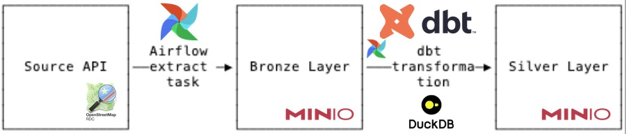

# UK Hospital Geospatial Data Lakehouse

This repository extracts center points (among other attributes) for UK hospitals
from OpenStreetMaps Overpass API, saves the results as geoJSON to a MinIO
bronze layer, and then transforms the results into GeoParquet in a MinIO silver
layer using dbt-duckdb. Orchestration takes place using the Airflow DAG
`load_hospitals`.

## Setup

1. First, create a `.env` file based on `.env.sample`. The user agent must be a
unique identifier.
2. Build the containers with `docker compose up`.
3. Access the Airflow UI at `http://localhost:8080`. Credentials are written to
`airflow/simple_auth_manager_passwords.json.generated` once the container starts.
4. Open the `load_hospitals` DAG and click **Trigger**. If you are rate limited,
    check `https://overpass-api.de/api/status`.

## Inspecting the silver layer

After a successful DAG run, `inspect_parquet.ipynb` can be executed inside the
Airflow container (where MinIO credentials are already set) and the results written
back to the local file via the bind mount:

```bash
docker compose exec airflow jupyter nbconvert --to notebook --execute --inplace /opt/notebooks/inspect_parquet.ipynb
```

Open `notebooks/inspect_parquet.ipynb` locally to view the outputs. The notebook covers:

- Schema of the silver Parquet file
- Total row count and row count per country
- 5 sample rows
- Null counts for key columns
- Hospitals within 50km of Lancaster

In a production environment, this querying of the silver layer could be done 
with Trino. There is a DuckDB connector for Trino but using the in-memory 
DuckDB like we do here is not supported. Therefore, if Trino is needed for
a production environment (in order to deal with larger, heterogenous datasets),
swapping DuckDB for a different backend such as Hive, Iceberg or Delta Lake
could be required.

## Design decisions and trade-offs

### Tooling
- **Docker:** Provides dependency isolation and consistency across environments
- **Airflow:** Industry standard with large community support base.
- **dbt:** Adds software engineering best practices (incl. testing) to the transformation step.
- **DuckDB:** Provides fast, lightweight in-memory data processing with dbt, MinIO and parquet integration.
DuckDB was chosen as the dataset in question is small and does not require distributed processing.
- **MinIO:** S3-compatible open-source object storage to serve as the data lake.

Extra tooling would be required to turn this into a 'proper' lakehouse, such as a data catalog.
See note above for comments on Trino.

### Pipeline workflow

The pipeline processes a 'snapshot' of the hospital data stored in OSM. This OSM
data is treated as a 'single source of truth' and not expected to change frequently.
Changes are most likely to be in the metadata tags or removal/addition of hospitals.
The pipeline is scheduled to run monthly. Each month a new timestamped geojson object is created
in the bronze layer. The silver layer then takes only the latest snapshot. As is default
in dbt, the existing data is dropped and the model is rebuilt with the new data.
Old snapshots could be removed from the bronze layer after a given retention period.
Incremental loading is not supported for this in-memory DuckDB infrastructure.
It would be possible if the backend was swapped out with Hive, Iceberg or Delta Lake.
Full idempotency was not implemented, in order to keep change history and allow
for auditability of the bronze layer. If the cost of the data size became an issue,
the timestamp could be removed from the bronze files, causing the old files
to be overwritten. 

The Airflow extraction task saves geoJSON files to the MinIO Bronze layer,
where dbt with the DuckDB adapter reads and processes the files, 
materialising a dbt model in the silver layer as a (Geo)Parquet file.

### Production deployment
In order to deploy to production a few changes would need to be made:
- Run Airflow Webserver, Scheduler, DB, etc. as separate nodes in a cluster (e.g. Kubernetes)
- Change Airflow auth manager
- Assuming the lakehouse is to be extended with further pipelines, distributing processing
may become necessary (e.g. Spark)
- Add a deployment step to the GitHub Workflows
- Add a data catalog
